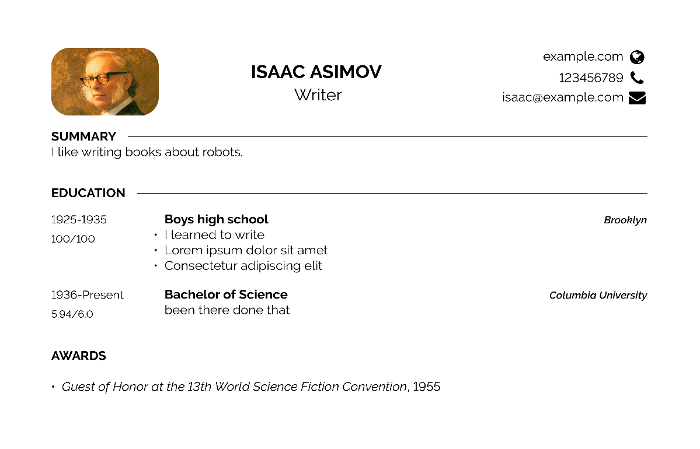

# Curricust - CV generator

Write your curriculum/resume in YAML files, and convert those to a PDF based on a LaTeX template. The YAML->LaTeX converter is written in Rust, while the LaTeX->PDF conversion can be done e.g. with `pdflatex`.

## Advantages

Writing a CV in YAML allows you to:
- **version control** the data (e.g. with git), getting access to history
- **separate the style** from the data
- try out **different styles** without changing the data
- easily disable, reorder and change the text length of single sections and items with **saveable configurations**
- built-in **multilanguage** support in the same file and in single text fields, along with a dictionary for common words
- **reuse** the same data for other purposes, e.g. to build a website, if you ever needed to (the Rust package is easily extendable)

### Comparison

||version controllable|separate style|try different styles|configs|multilanguage|reusability|
|---|---|---|---|---|---|---|
|Web services e.g. Europass|❌|✔️|✔️|❌|🟡|❌|
|Bare LaTeX|✔️|✔️|✔️|❌|🟡|❌|
|Curricust|✔️|✔️|✔️|✔️|✔️|✔️|

### Additional features

With the `--check-links` option the Rust converter will make a GET request to all of the links present in the document, to make sure they all work.

## YAML file structure

Text fields support basic Markdown, so you can insert links, lists and put emphasis on things.

Take a look a the `example/` folder for an actual example of the rules explained below.

### Text field attributes

All text fields in the YAML files support attributes to specify the locale (e.g. `en`, `it`) and the display mode (e.g. `short`, `long`) with this syntax: `fieldname-attribute1-attribute2` (e.g. `institution-en-short`). In case there are multiple alternatives for the same text field, the one whose attributes best match the currently active attributes is chosen.

To specify the currently active attributes, you can use `locale`, `display` in various parts of the YAML files. Moreover you can customize `order` and `visibility`.
If you use `locale`, `display`, `order`, `visibility` with a string (e.g. `display: long`) you set the attribute in general, but you can also set it for some particular item id (e.g. `display: { _: long, high-school-item: short }` displays everything in long form except for high school).

### Including other files

Fields with nested sub-fields (e.g. `section-education`) can be put in separate files by prepending the field name with `include-`. All `include-` parts support the following fields:
- `file` (required): the file to include
- active attribute specifiers: `locale`, `display`, `order`, `visibility` to apply to the included file

### Fields structure

The root YAML file can contain the following fields. `*` fields are required, but if you don't want anything there just use `""`.
- active attribute specifiers: `locale`, `display`, `order`, `visibility` to apply from the point they are encountered
- `dictionary` is a dictionary of key-value pairs (attributes are supported on keys)
- `header` contains `name`\*, `career`, `email`, `phone`, `location`, `website`, `github`, `linkedin` and:
    - `summary` and `skills`, which contain `title`\* (the title of the section) and `summary`\*/`skills`\*

These fields specify section of different types. They all have a `title`\*, a `description`, and `items` (a list). The sub-fields in the list below are to be intended as children of `items`:
- `section-education`: `degree`\*, `institution`\*, `when`\*, `grade`, `details`
- `section-award`: `name`\*, `when`\*, `grade`
- `section-job`: `role`\*, `company`\*, `where`\*, `when`\*, `topics`, `details`
- `section-project`: `name`\*, `technologies`\*, `links`, `when`, `details`
- `section-talk`: `name`\*, `event`\*, `when`\*

## build.sh usage

`build.sh` can be used to build a PDF file given the following arguments: the base YAML file, the output LaTeX file to generate, the LaTeX template to use to build the final PDF file. For more information about `build.sh`, run `build.sh --help`.

Internally `build.sh` calls:
- the Rust module in this repo to turn the YAML files into a LaTeX file (requires having Rust installed)
- `pdflatex` to convert the generated LaTeX file along with the template to PDF (requires having `texlive` installed)

For example, to build the example in the `example/` folder with the Developer CV template, the command would be `./build.sh ./example/base.yml ./build/example.tex ./template/developercv.cls`.

## Templates

Templates are `.cls` files to be used directly. They contain no CV data, but only style definitions.

If you want to create or adapt your own style you need to implement some LaTeX functions. You can take a look a the templates that are already implemented.

### Developer CV

The [Developer CV](https://www.overleaf.com/latex/templates/cv-developer/rdycxzvvnvcc) found on OverLeaf with a few changes: [developercv.cls](./template/developercv.cls).

On Arch Linux the following `texlive` packages are needed for this template:
- `texlive-basic` - initial installation
- `texlive-latexrecommended` - extarticle.cls
- `texlive-latexextra` - moresize.sty
- `texlive-fontsextra` (~500MB) - raleway.sty
